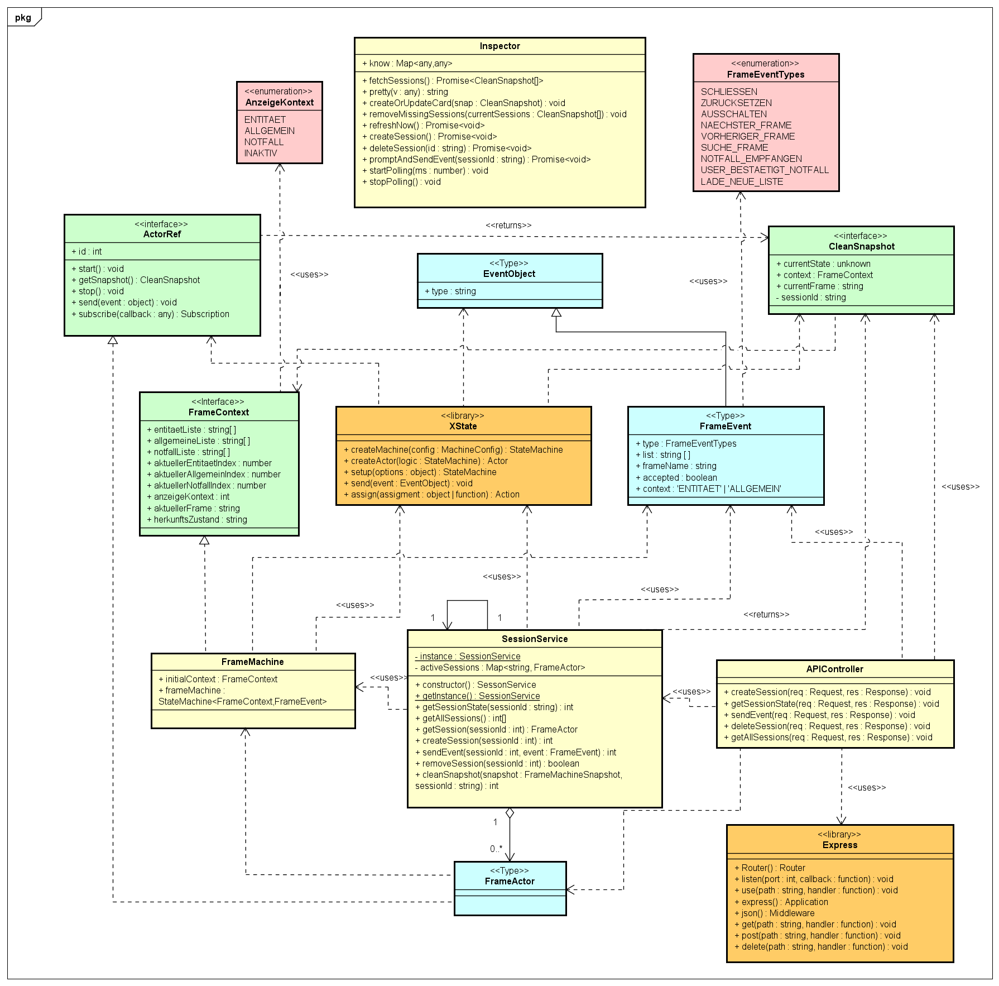
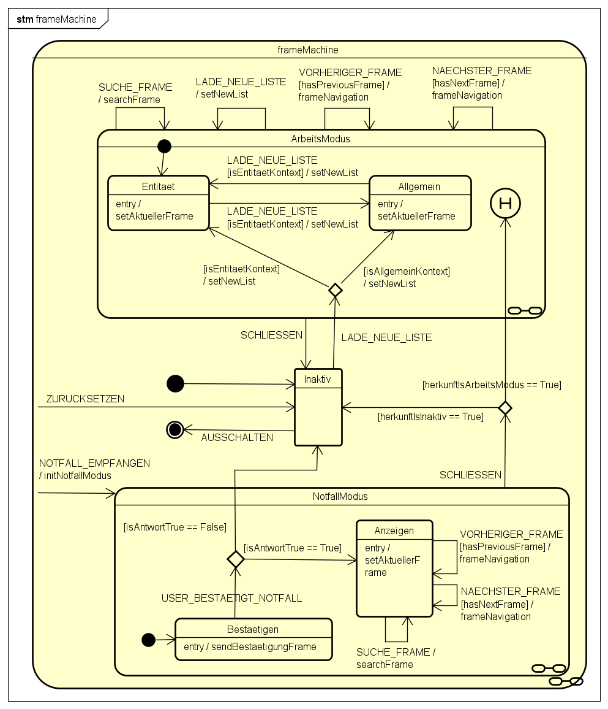
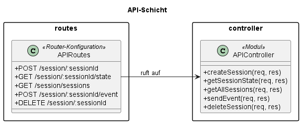
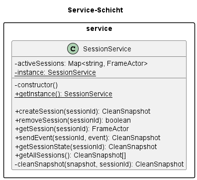
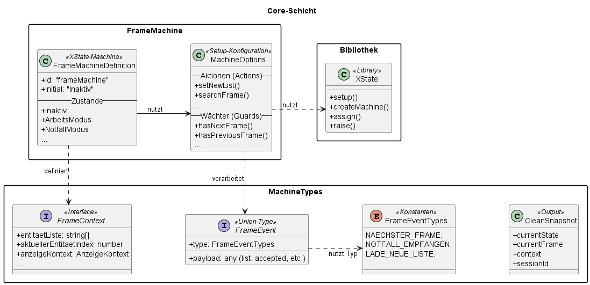

# Frame-Management-Service

## Table of Contents

1.  [About the Software](#about-the-software)
2.  [Technologies Used](#technologies-used)
3.  [Architecture Overview](#architecture-overview)
4.  [Key Features](#key-features)
5.  [API Reference](#api-reference)
6.  [How to Start?](#how-to-start)

-----

## About the Software

The **Frame-Management-Service** is a robust, RESTful microservice designed to manage the logic and state of user interactions within information systems. It acts as a central logic engine that handles navigation through lists of information "frames" (templates), ensuring that users see the correct content based on their current context (e.g., an Entity workflow vs. a General workflow).

At its core, the software replaces imperative, error-prone logic with a **Statechart-based architecture**. This allows the service to:

  * Manage complex state transitions deterministically.
  * Handle high-priority interrupts (such as Emergency modes) instantly via Preemption.
  * Provide a clear, JSON-based interface for external frontend applications.

The service is built to be stateless regarding the connection but stateful regarding the session, holding transient state in memory for high-performance access during active user sessions.

-----

## Technologies Used

The project utilizes a modern stack for both the backend service and the accompanying visual interface:

  * **Backend Runtime:** Node.js
  * **Language:** TypeScript
  * **Web Framework:** Express.js
  * **State Management:** XState v5 (Statechart Actor Model)
  * **Frontend (GUI):** HTML5, CSS3, JavaScript
  * **Testing:** Jest, Supertest
  * **Tools:** Postman (for integration testing)

-----

## Architecture Overview

The software implements a **Model-View-Controller (MVC)** architecture combined with a strict **Layered Architecture** to ensure modularity and separation of concerns.

### 1\. Model (Core Layer)

  * **Location:** `/src/core`
  * **Description:** This is the domain logic core. It defines the `frame.machine.ts`, which uses **XState** to model the behavior of the system implementing a Statechart. It manages the `FrameContext` (data) and processes `FrameEvents`. It is completely decoupled from the HTTP layer.

### 2\. Controller (API Layer)

  * **Location:** `/src/api`
  * **Description:** Acts as the entry point for HTTP requests. The `controller.ts` receives requests, validates inputs (like `sessionId` and event payloads), and delegates commands to the Service layer .

### 3\. Service Layer

  * **Location:** `/src/services`
  * **Description:** The `SessionService` implements the **Singleton & Proxy** design pattern. It acts as a bridge between the Controller and the Model, managing the lifecycle of XState actors using the **Factory Method** pattern and ensuring data isolation between parallel sessions.

### 4\. View (GUI & API)

  * **Location:** `/src/ui` (and API Responses)
  * **Description:**
      * **Goal:** Real-time management of the status of each active session in the system. Visualization of the status of each session in the form of a "Card" with data such as `Session-ID`, `State`, `Current Frame` and `context` (internal data handled by Statechart).
      * **Session Inspector (GUI):** A dedicated graphical interface located in `/src/ui`. It consists of `index.html`, `inspector.js`, and `styles.css` . It consumes the API to visualize the real-time state of all active sessions, providing a dashboard for monitoring and debugging.

### UML Diagrams

<p align="center">
  
  <br>
  <i>UML Component Diagram.</i>
</p>

<p align="center">
  
  <br>
  <i>UML Class Diagram.</i>
</p>

<p align="center">
  
  <br>
  <i>frameMachine UML Statechart Diagram.</i>
</p>

<p align="center">
  
  <br>
  <i>API-Schicht UML Class Diagram.</i>
</p>

<p align="center">
  
  <br>
  <i>Service-Schicht UML Class Diagram.</i>
</p>

<p align="center">
  
  <br>
  <i>Core-Schicht UML Class Diagram.</i>
</p>

-----

## Key Features

  * **Multi-Session Isolation:** Manages multiple concurrent user sessions. Thanks to the **Actor Model**, every session acts as an isolated process in memory; actions in one session do not affect others.
  * **Generic Navigation:** Supports flexible navigation (`NAECHSTER_FRAME`, `VORHERIGER_FRAME`, `SUCHE_FRAME`) through any type of list provided in the context.
  * **Context Awareness:** The system distinguishes between contexts (e.g. `ENTITAET`, `ALLGEMEIN`). Navigation commands automatically apply only to the currently active context list .
  * **Emergency Preemption:** Supports an immediate interrupt mechanism. A `NOTFALL_EMPFANGEN` event pauses the current workflow and forces a transition to the Emergency state, regardless of the current active frame.
  * **Visual Debugging:** Includes a "Session Inspector" GUI that renders state machines as interactive cards, allowing developers to see the exact state, context, and frame index of every user in real-time.

-----

## API Reference

The service provides a RESTful API. The most dynamic endpoint is the **Event** endpoint, which accepts various JSON payloads depending on the action required.

### Endpoints

| Method | Endpoint | Description | Payload |
| :--- | :--- | :--- | :--- |
| `POST` | `/api/session/:sessionId` | Creates a new session with parameter ID as `:sessionId`. | None. Parameter `:sessionId` given in the url.|
| `GET` | `/api/session/:sessionId/state` | Returns the current snapshot (state & frame). | - |
| `POST` | `/api/session/:sessionId/event` | Sends a logic event to the state machine. | Depends on the event type; details [here](#event-payload-examples). |
| `GET` | `/api/session/sessions` | Lists all active sessions. | - |
| `DELETE` | `/api/session/:sessionId` | Deletes a session. | - |

### Event Payload Examples 
(`/api/session/:sessionId/event`)

The system handles different types of events defined in the `FrameEvent` type (in `/src/core/machine.types.ts`), these will be redirected to the Actor Statechart of the session given in the url `/:sessionId/`.

#### **0. Data type**

Statechart event types
```typescript
const FrameEventTypes = {
  SCHLIESSEN: 'SCHLIESSEN',
  ZURUCKSETZEN: 'ZURUCKSETZEN',
  AUSSCHALTEN: 'AUSSCHALTEN',
  NAECHSTER_FRAME: 'NAECHSTER_FRAME',
  VORHERIGER_FRAME: 'VORHERIGER_FRAME',
  SUCHE_FRAME: 'SUCHE_FRAME',
  NOTFALL_EMPFANGEN: 'NOTFALL_EMPFANGEN',
  USER_BESTAETIGT_NOTFALL: 'USER_BESTAETIGT_NOTFALL',
  LADE_NEUE_LISTE: 'LADE_NEUE_LISTE',
} as const;
```

Data type in the payload
```json
{
  "type": "FrameEventTypes",
  "context": " 'ENTITAET' | 'ALLGEMEIN' ",
  "list": string[],
  "accepted": boolean,
  "frameName": "string"
}
```

#### **1. Simple Navigation (Next Frame, Last Frame)**

Next Frame
```json
{
  "type": "NAECHSTER_FRAME"
}
```
Last Frame
```json
{
  "type": "VORHERIGER_FRAME"
}
```

#### **2. Specific Search (Jump to Frame)**
Requires the name of the target frame.

```json
{
  "type": "SUCHE_FRAME",
  "frameName": "FrameB"
}
```

#### **3. Load a New List (Context Initialization)**
Requires the list data and the context (`'ENTITAET' | 'ALLGEMEIN'`) target.

```json
{
  "type": "LADE_NEUE_LISTE",
  "context": "ENTITAET",
  "list": ["FrameA", "FrameB", "FrameC"]
}
```

#### **4. Trigger Emergency**
Requires the list of emergency frames.

```json
{
  "type": "NOTFALL_EMPFANGEN",
  "list": ["FrameA", "FrameB"]
}
```

#### **5. Confirm Emergency**
User response to the emergency prompt.

```json
{
  "type": "USER_BESTAETIGT_NOTFALL",
  "accepted": true
}
```

#### **6. Lifecycle events**

To exit `ArbeitModus` or `NotfallModus`.
```json
{
  "type": "SCHLIESSEN",
}
```
Reset the Statechart with neutral initial values.
```json
{
  "type": "ZURUCKSETZEN",
}
```
Disable the Statechart.
```json
{
  "type": "AUSSCHALTEN",
}
```

### Responses

The API returns standard HTTP status codes and JSON bodies .   

#### **1. Success Responses**

Session Creation `(POST ../session/:id)` Returns status `201 (Created)` for new session or `200 (OK)` for recreated session (reseted) with a confirmation message and the initial state.
```json
{
  "message": "Session ID ':id' created.",
  "cleanSnapshot": {
    "sessionId": ":id",
    "currentState": "Inaktiv",
    "currentFrame": "LEERER_FRAME",
    "context": {
      "entitaetListe": [],
      "allgemeineListe": [],
      "notfallListe": [],
      "aktuellerEntitaetIndex": 0,
      "aktuellerAllgemeinIndex": 0,
      "aktuellerNotfallIndex": 0,
      "anzeigeKontext": "INAKTIV",
      "aktuellerFrame": "LEERER_FRAME",
      "herkunftsZustand": "Inaktiv"
    }
  }
}
```
State Retrieval & Event Processing (`GET ../:id/state`, `POST ../:id/event`) Returns status `200` with the `CleanSnapshot` object.

```json
{
  "sessionId": ":id",
  "currentState": { "ArbeitsModus": "Entitaet" },
  "currentFrame": "FrameA",
  "context": {
    "entitaetListe": ["FrameA", "FrameB"],
    "aktuellerEntitaetIndex": 0,
    "anzeigeKontext": "ENTITAET",
    ...
  }
}
```
Get All Sessions (`GET ../sessions`) Returns status `200`.

```json
{
  "count": 2,
  "sessions": [
    { "sessionId": "user-1", "currentFrame": "FrameA", ... },
    { "sessionId": "user-2", "currentFrame": "LEERER_FRAME", ... }
  ]
}
```

Delete a existing session (`DELETE ../session/:id`) Returns status `200`.

```json
{
  "message": "Session ID ':id' successfully deleted."
}
```

#### **2. Error Responses**

Client Errors (`4xx`) Occurs if inputs are invalid or sessions are not found.

- `400 Bad Request`: Invalid JSON payload or missing event type.

- `404 Not Found`: `Session ID` does not exist (for `GET/DELETE/EVENT`).

```json
{
  "error": "Session with ID 'user-99' not found."
}
```
Server Errors (`5xx`) Occurs if the state machine fails or internal errors happen.

```json
{
  "error": "An internal server error occurred."
}
```

-----

## How to Start?

Follow these steps to set up the environment and run the software locally.

### 1\. Prerequisites

Ensure you have the following installed on your machine:

  * **Node.js** (Version 18 or higher recommended). Download from [nodejs.org](https://nodejs.org/).
  * **npm** (Node Package Manager). This usually comes installed with Node.js.

### 2\. Clone and Install

Open your terminal/command prompt and navigate to the project folder.

**Install Dependencies:**

Run the following command to download all required libraries defined in `package.json` (including Express, XState, TypeScript, etc.):
 
```bash
npm install
```
*This automatically installs:*

* `express` (Web Server)
* `xstate` (State Management Logic)
* `typescript` & `ts-node` (Language support)
* `jest` & `supertest` (Testing tools)

*Alternatively, you can run it directly using ts-node:*

```bash
npm install typescript --save-dev
npx tsc --init
npm install express@latest xstate@latest
npm install @types/node @types/express ts-node-dev --save-dev
npm install jest @types/jest ts-jest supertest @types/supertest --save-dev
```


### 3\. Run the Server

You can start the server in development mode using:

```bash
npm run dev
```

*Alternatively, you can run it directly using ts-node:*

```bash
npx ts-node src/index.ts
```

The server will start on **http://localhost:3000**.

### 4\. Access the GUI

Once the server is running, you can access the graphical Session Inspector to test the software visually.

1.  Open your web browser.
2.  Go to: **http://localhost:3000/inspector**.
3.  You can now create sessions and send events using the visual interface.

### 5\. Run Tests (Optional)

To verify that the logic is working correctly, you can run the automated test suite:

```bash
npm test
```

This executes the White-Box tests (logic) and Black-Box tests (API integration) using Jest.
